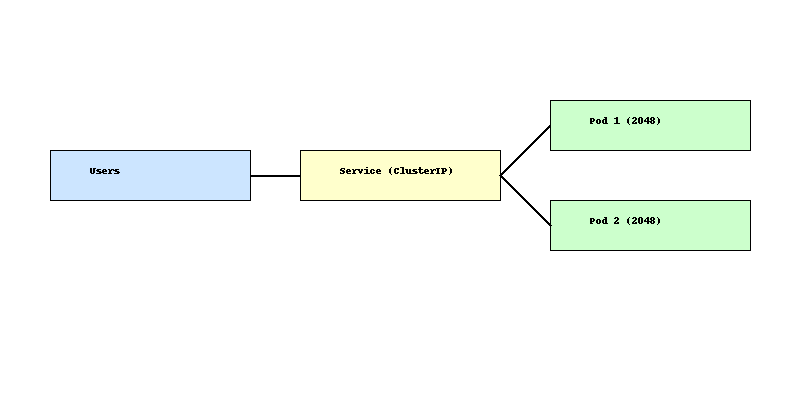

# EKS 2048 Autoscaling 🎮

This project deploys the classic 2048 game on Amazon EKS with autoscaling and basic monitoring.

## 🧩 Architecture Overview



## 📁 Folder Structure

- `manifests/` - Kubernetes YAML files for deployment, service, and HPA
- `cloudwatch-config/` - Sample CloudWatch agent config
- `README.md` - Project overview

## 🚀 How to Use

1. Apply the Kubernetes manifests:
```bash
kubectl apply -f manifests/
```

2. (Optional) Configure CloudWatch Agent for metrics:
```bash
kubectl apply -f cloudwatch-config/cwagent-configmap.yaml
```

3. Test the service using `kubectl port-forward` or expose with LoadBalancer.

## ⚙️ Prerequisites

- Amazon EKS cluster
- `kubectl` configured
- Metrics server installed in your cluster

## 📈 Autoscaling

This project uses HPA to automatically scale pods based on CPU usage.

